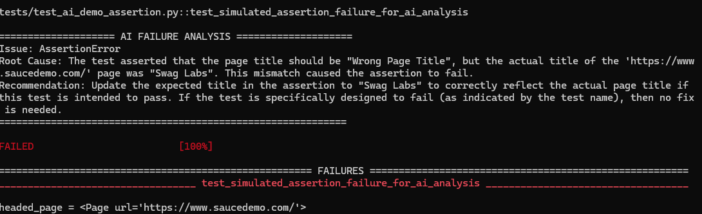

# Enterprise-Grade Python Automation Framework (Web UI & API) with AI-Assisted Failure Diagnostics

This repository showcases an **enterprise-ready, highly scalable test automation framework** designed to demonstrate professional QA engineering practices. Built with **Python**, **Playwright**, and **Pytest**, it integrates comprehensive Web UI and API test automation with a state-of-the-art **AI-Assisted Failure Analysis** engine powered by **Gemini 2.5 Flash** (`google-genai` SDK v1.0+).

---

## 🚀 Architectural Decisions & Rationale

When designing an automation framework for scale, every technical decision must optimize for **reliability**, **maintainability**, and **speed**. Below are the core technical choices of this framework and why they were made.

### 1. Why Page Object Model (POM)?
The Web UI test suite (`tests/test_web_ui.py`) is structured using the **Page Object Model (POM)** pattern. 
*   **Decoupled Concerns:** We isolate element selectors (locators) and page-specific interactions (`pages/`) from the actual test flow definitions (`tests/`).
*   **High Maintainability:** If a developer changes a button selector from `[data-test="login-button"]` to `#submit-btn`, we update it **in exactly one place** (the `LoginPage` class) rather than updating 50 different test files.
*   **Dry Principle (Don't Repeat Yourself):** Common interactions (such as logging in or querying the cart status) are encapsulated in reusable methods.
*   **Business-Readable Tests:** Tests are highly readable, structured as logical actions that reflect real user stories (e.g., `login_page.login(...)` then `inventory_page.add_product_to_cart_by_name(...)`).

### 2. Why Playwright over Selenium?
Playwright represents the next generation of web automation, offering substantial benefits over legacy frameworks:
*   **Auto-Waiting Resilience:** Playwright automatically waits for elements to be visible, actionable, and stable before performing actions (like clicks or inputs), virtually eliminating the "flaky tests" common with explicit/implicit waits in Selenium.
*   **Speed & Architecture:** Playwright connects directly to browsers via WebSockets instead of relying on HTTP-based webdriver translation layers, making it significantly faster.
*   **Modern Locators:** It offers built-in semantic locators (`get_by_role`, `get_by_text`) that align with accessibility standards and are much more robust to UI layout shifts.

### 3. Integrated API Testing (Dual-Layer Verification)
A professional QA framework should not test the UI in isolation. This project includes API automation testing targeting public endpoints ([ReqRes](https://reqres.in)):
*   **Speed:** API tests execute in milliseconds, allowing fast feedback loops.
*   **Isolation:** Ensures backend and authentication APIs work independently before running expensive Web UI end-to-end flows.

### 4. 🤖 The "Wow" Factor: AI-Assisted Failure Diagnostics
The signature feature of this framework is its **intelligent, self-diagnosing test execution pipeline** located in `utils/ai_analyzer.py` and connected via Pytest hooks in `tests/conftest.py`.

*   **How it works:** When any test fails, Pytest dynamically intercepts the exception and catches the complete Python traceback (stack trace). 
*   **AI Integration:** If `GEMINI_API_KEY` is present, the framework immediately forwards the traceback to Gemini 2.5 Flash using the modern `google-genai` SDK.
*   **Instant Triage:** Gemini acts as an autonomous Senior QA Engineer, printing a clean, 3-line analysis directly to your console:
    1.  **Issue**: The exact category of error (e.g., `TimeoutError` or `AssertionError`).
    2.  **Root Cause**: What specifically went wrong (e.g., mismatching titles, elements not rendering within 3s).
    3.  **Recommendation**: Concrete, step-by-step instructions on how to fix the error.

---

## 🛠️ Technology Stack

| Technology | Purpose | Key Benefit |
| :--- | :--- | :--- |
| **Python 3.11+** | Core Language | Robust, standard language in automation and data science. |
| **Playwright** | Web UI Automation | Rapid, stable, headed/headless test runs with native auto-waiting. |
| **Pytest** | Test Runner | Highly extensible fixture architecture, hooks, and clean reporting. |
| **Requests** | API Client | Simple, lightweight HTTP client for API test validation. |
| **Google GenAI SDK** | AI Integration | Uses the official, next-generation `google-genai` SDK to query Gemini. |
| **GitHub Actions** | CI/CD | Runs complete headless suites automatically on every git push/PR. |

---

## 📂 Framework Layout

```text
miniProject/
│
├── .github/
│   └── workflows/
│       └── test.yml         # GitHub Actions CI workflow config (runs headless)
│
├── pages/                   # POM Layer (Selectors & Page Actions)
│   ├── login_page.py        # LoginPage interactions & selectors
│   └── inventory_page.py    # InventoryPage operations & assertions
│
├── tests/                   # Test Suite Layer (Execution & Asserts)
│   ├── conftest.py          # Setup/Teardown fixtures & Pytest error hook
│   ├── test_web_ui.py       # Valid Web UI test cases (SauceDemo)
│   ├── test_api.py          # Valid REST API test cases (ReqRes)
│   ├── test_ai_demo_assertion.py # Simulated assertion failure for AI test demo
│   └── test_ai_demo.py      # Simulated element locator timeout failure
│
├── utils/                   # Shared Utilities
│   └── ai_analyzer.py       # Google GenAI integration for error logging
│
├── pytest.ini               # Test suite configuration & marker registration
├── requirements.txt         # Project-wide dependencies
└── README.md                # Comprehensive portfolio documentation
```

---

## 🚀 Local Installation & Execution

### Prerequisites
*   Python 3.11 or later installed.
*   A Gemini API Key (get one free at [Google AI Studio](https://aistudio.google.com/)).

### 1. Initialize Project & Environment
Clone your repo and open your terminal (PowerShell on Windows):
```powershell
# Navigate to the workspace
cd C:\Users\PC\Desktop\Code\miniProject

# Create and activate virtual environment
python -m venv .venv
.\.venv\Scripts\Activate.ps1
```

### 2. Install Packages & Drivers
```powershell
pip install -r requirements.txt
playwright install chromium
```

### 3. Run Valid (Successful) Tests
To execute standard, non-failing tests (Web UI and API):
```powershell
pytest -m "not ai_demo" -v
```

---

## 🤖 Running AI Failure Analysis Demo

To showcase the AI's diagnostic capabilities to a hiring manager or team, we have provided built-in simulated failure scripts.

### 1. Export your Gemini API Key
**Windows (PowerShell)**:
```powershell
$env:GEMINI_API_KEY="your_api_key_here"
```
**Linux / macOS**:
```bash
export GEMINI_API_KEY="your_api_key_here"
```

### 2. Execute a Simulated Failure Test
Run one of our marked demo tests (which will intentionally fail to trigger the AI):
```powershell
pytest tests/test_ai_demo_assertion.py -m "ai_demo" -v
```

### 3. AI Diagnostic Output
When the test fails, Pytest catches the traceback and outputs Gemini's diagnostic directly to your console:



```text
==================== AI FAILURE ANALYSIS ====================
Issue: AssertionError
Root Cause: The test asserted that the page title should be "Wrong Page Title", but the actual title of the 'https://www.saucedemo.com/' page was "Swag Labs". This mismatch caused the assertion to fail.
Recommendation: Update the expected title in the assertion to "Swag Labs" to correctly reflect the actual page title if this test is intended to pass. If the test is specifically designed to fail (as indicated by the test name), then no fix is needed.
============================================================
```

---

## 🔄 Robust CI/CD Workflow (GitHub Actions)

This framework is fully configured with automated CI pipelines (`.github/workflows/test.yml`). Every time a developer commits code to `main`:
1.  **Virtual Machine Setup**: Launches an Ubuntu runner, instantiates Python 3.11, and caches python dependencies.
2.  **Environment Adaptation**: Playwright system-level browser drivers are installed along with required operating system libraries (`playwright install chromium --with-deps`).
3.  **Smart Selective Testing**: The pipeline automatically excludes the `ai_demo` markers (`pytest -m "not ai_demo" -v`), ensuring **green pipelines** and preventing fake failure alerts in production.
